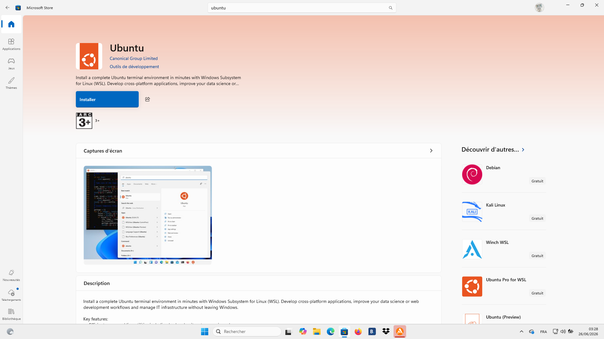
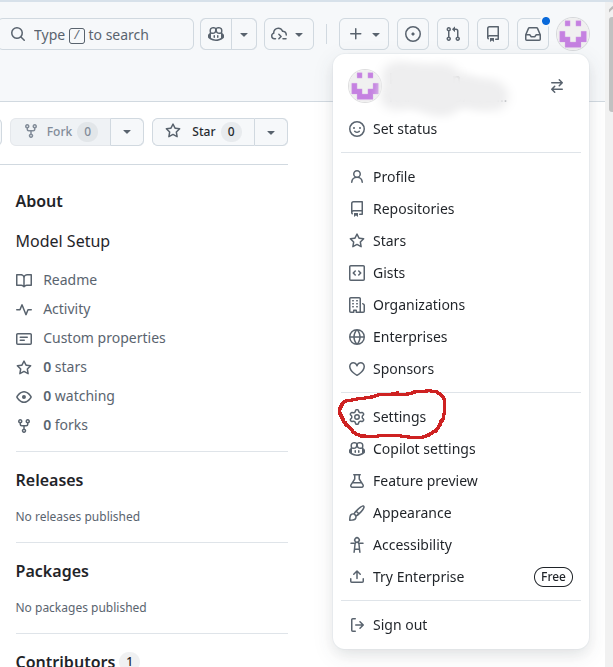
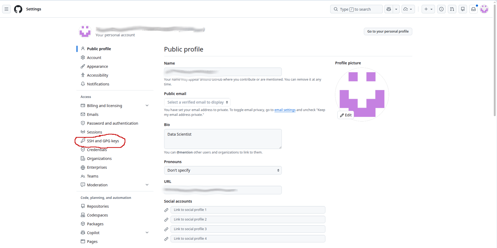
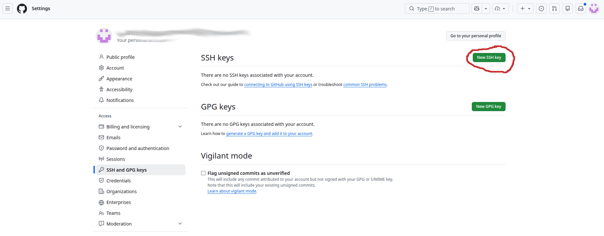
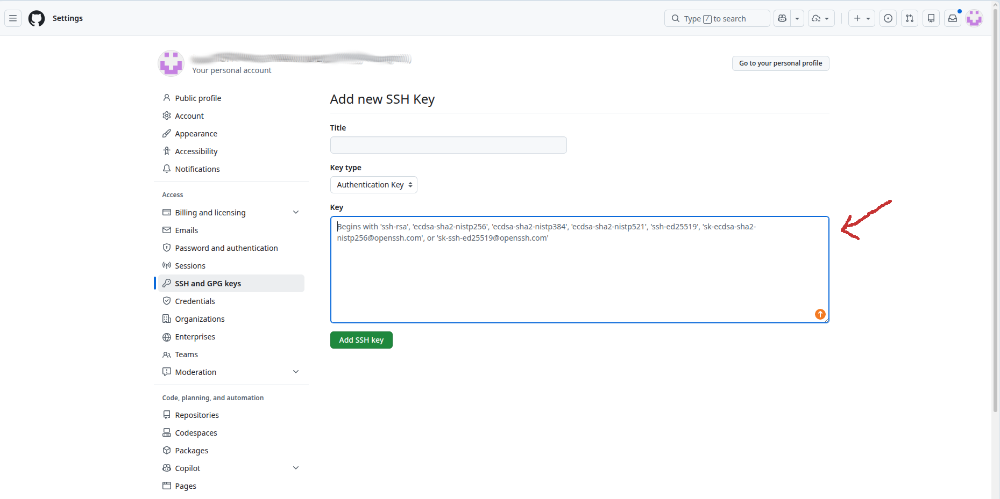

# Cloning the Repository (GitHub)

Before setting up the environment, you need to download (clone) the project to your local machine. You must clone the **develop** branch. You can do this using either **SSH** (recommended for frequent contributors) or **HTTPS** (easier for beginners).

## Option A: Clone via SSH (Recommended)

To use SSH, you must first have an SSH key configured on your GitHub account.
_If you haven't done this yet, please follow these instructions:_

!!! important
    **GitHub Account Required:** If you don't have a GitHub account yet, you must first [create one](https://github.com/join). You will need the exact **email address** associated with your GitHub account to successfully generate your SSH key below.

### 1. <span id="generate-key">Generate an SSH key (choose depending on your Operating System):</span>
   - **On Linux and Mac os:** Open the terminal and run these commands:

     ```bash
     ssh-keygen -t ed25519 -C "your_email@example.com"
     ```

     **Example Output:**

     ```text
     Generating public/private ed25519 key pair.
     Enter file in which to save the key (/home/user/.ssh/id_ed25519): [Press Enter]
     Enter passphrase (empty for no passphrase): [Press Enter]
     Enter same passphrase again: [Press Enter]
     Your identification has been saved in /home/user/.ssh/id_ed25519
     Your public key has been saved in /home/user/.ssh/id_ed25519.pub
     ```

     Then, display the generated key:

     ```bash
     cat ~/.ssh/id_ed25519.pub
     ```

     **Example Output:**

     ```text
     ssh-ed25519 AAAAC3NzaC1lZDI1NTE5AAAAIP... your_email@example.com
     ```

     - Select the text starting with `ssh-ed25519` (the output of the `cat` command) and right-click to copy it.

   - **On Windows (using WSL - Windows Subsystem for Linux):**
     To easily run Linux commands, we recommend installing WSL.
     1. **Install WSL via the Microsoft Store:**
        - Open the **Microsoft Store** from your Windows Start menu.
        - Search for **Ubuntu** (the recommended Linux distribution).

        

        - Click **Get** or **Install** to download it.

     2. **Configure your Linux environment:**
        - Once installed, launch the **Ubuntu** app from your Start menu.
        - A terminal will open. Wait a few moments for the initial installation to finish.
        - It will ask you to create a **UNIX username** and a **password**. _(Note: when typing your password, characters won't appear on screen, this is a normal security feature)._
     3. **Generate your SSH Key:**
        - In the Ubuntu terminal you just configured, run these commands:

          ```bash
          ssh-keygen -t ed25519 -C "your_email@example.com"
          ```

          **Example Output:**

          ```text
          Generating public/private ed25519 key pair.
          Enter file in which to save the key (/home/user/.ssh/id_ed25519): [Press Enter]
          Enter passphrase (empty for no passphrase): [Press Enter]
          Enter same passphrase again: [Press Enter]
          Your identification has been saved in /home/user/.ssh/id_ed25519
          Your public key has been saved in /home/user/.ssh/id_ed25519.pub
          ```

          Then, display the generated key:

          ```bash
          cat ~/.ssh/id_ed25519.pub
          ```

          **Example Output:**

          ```text
          ssh-ed25519 AAAAC3NzaC1lZDI1NTE5AAAAIP... your_email@example.com
          ```

        - Select the text starting with `ssh-ed25519` (the output of the `cat` command) and right-click to copy it.

### 2. Add the key to GitHub:
   - Open Settings on your GitHub account

    

   - Open the "SSH and GPG keys" section

     


   - Click on "New SSH key"

     

   - Paste your SSH key and save

     

Once your SSH key is added to GitHub, open a terminal and run:

```bash
git clone -b develop git@github.com:opera-seaforward/seaforward-pytools.git
cd seaforward-pytools
```

## Option B: Clone via HTTPS

If you don't want to set up SSH keys right now, you can clone using HTTPS. You may be prompted to enter your GitHub username and password/personal access token.

```bash
git clone -b develop https://github.com/opera-seaforward/seaforward-pytools.git
cd seaforward-pytools
```

