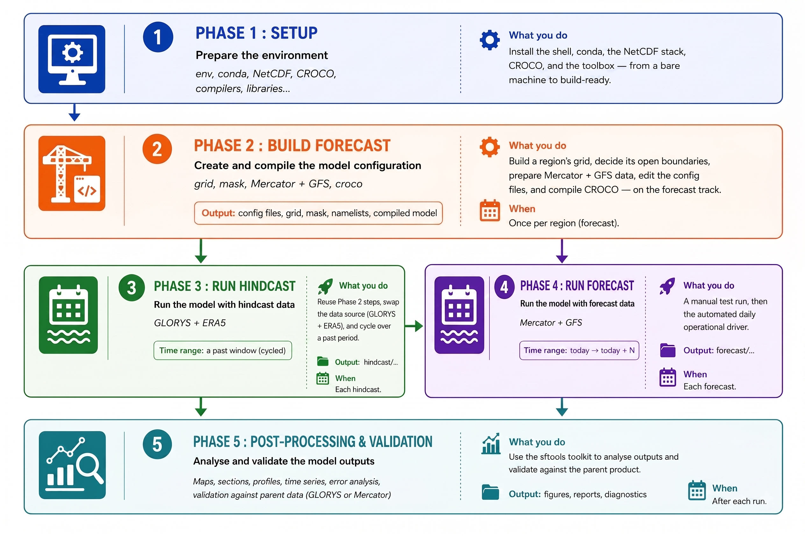

# Sea Forward — Hands-on Documentation

## Read them in order

| # | Document | What you do | When |
|---|----------|-------------|------|
| 1 | [Setup](phase1/01_setup.md) | Install the shell, conda, the NetCDF stack, CROCO, and the toolbox — from a bare machine to build-ready. | Once per machine. |
| 2 | [Building a Forecast Config](phase2/02_forecast_config.md) | Build a region's grid, decide its open boundaries, prepare Mercator + GFS data, edit the config files, and compile CROCO — on the forecast track. | Once per region (forecast). |
| 3 | [Running a Forecast](phase3/03_forecast.md) | A manual test run, then the automated daily operational driver. | Each forecast. |
| 4 | [Running a Hindcast](phase4/04_hindcast.md) | Reuse Phases 1–2's steps, swap the data source (GLORYS + ERA5), and cycle over a past period. | Each hindcast. |

!!! note
    Phase 1 is a prerequisite for everything (once per computer). Phase 2 builds a **forecast** configuration for a region and Phase 3 runs it. Phase 4 (hindcast) reuses Phase 2's *steps* but swaps the data source — it points back to Phase 2 rather than repeating it.




## Sea Forward Directory Structure

```
~/seaforward/
├── env.sh                # sourced each session: shared paths + compilers + NetCDF
├── environment.yml       # the conda environment
├── install/              # 00..04 build scripts (system libs + CROCO)
├── sftools/              # the Python CLI (download + pre-process) + vendored toolbox
├── code/                 # CROCO + croco_pytools (obtained by install/04 — git-ignored)
│   ├── croco/            # CROCO model source
│   └── croco_pytools/    # pre-processing toolbox
├── opt_seq/              # NetCDF/HDF5 stack, compiled from source (git-ignored)
├── data/                 # DATASETS_CROCOTOOLS bathymetry/coastline (git-ignored)
├── forecast/
│   ├── track.sh          # forecast per-track paths
│   ├── configs/          # forecast config recipes
│   ├── scratch/          # forecast test builds (binary + grid)
│   ├── model-runs/       # kept forecast outputs
│   └── run_forecast_today.sh
├── hindcast/
│   ├── track.sh
│   ├── configs/  scratch/  model-runs/
│   └── run_hindcast_cycle.sh
└── docs/                 # these documents
```

## The session ritual (every time)

```bash
source ~/seaforward/env.sh                 # shared paths + compilers + NetCDF
source ~/seaforward/forecast/track.sh      # OR hindcast/track.sh — pick the track
conda activate seaforward                  # the Python tools
```

To **compile** the model, leave conda first (`conda deactivate`) so the system
linker uses the repo's `opt_seq` NetCDF, then `./jobcomp`.

!!! important
    ## Conventions used in these docs :
      - Commands are shown for the **Canary_12** example region (22°W–15.5°W, 14°N–24°N, 1/12°). Replace its numbers with your region's.
       - `~/seaforward` is the repository root; `<you>` is your Linux username.
       - A ✅ check after a step tells you what a correct result looks like.
       - ⚠️ marks a place people commonly trip; read those twice.