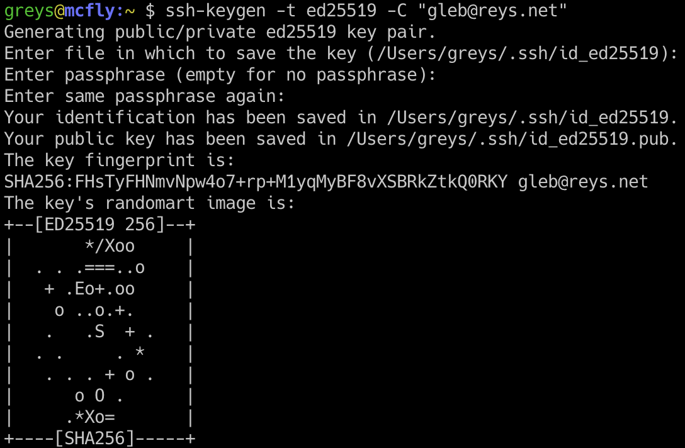

# Sea Forward: Data Download Guide

This guide explains how to easily download environmental data (**ERA5** atmospheric data, **GloFAS** river discharge data, and **Mercator/HYCOM** ocean data) for your CROCO simulations using the seaforward_data wrapper.

---

## 0. Cloning the Repository (GitHub)

Before setting up the environment, you need to download (clone) the project to your local machine. You must clone the **develop** branch. You can do this using either **SSH** (recommended for frequent contributors) or **HTTPS** (easier for beginners).

### Option A: Clone via SSH (Recommended)

To use SSH, you must first have an SSH key configured on your GitHub account.
_If you haven't done this yet, please follow these instructions:_

!!!info
    **GitHub Account Required:** If you don't have a GitHub account yet, you must first [create one](https://github.com/join). You will need the exact **email address** associated with your GitHub account to successfully generate your SSH key below.

1. Generate an SSH key (choose depending on your Operating System):
   - **On Linux:** Open the terminal and run these commands:

     ```bash
     ssh-keygen -t ed25519 -C "your_email@example.com"
     cat ~/.ssh/id_ed25519.pub
     ```

     

     - Copy your SSH key

   - **On Windows (using WSL - Windows Subsystem for Linux):**
     To easily run Linux commands, we recommend installing WSL.
     1. **Install WSL via the Microsoft Store:**
        - Open the **Microsoft Store** from your Windows Start menu.
        - Search for **Ubuntu** (the recommended Linux distribution).

          

        - Click **Get** or **Install** to download it.

     2. **Configure your Linux environment:**
        - Once installed, launch the **Ubuntu** app from your Start menu.
        - A terminal will open. Wait a few moments for the initial installation to finish.
        - It will ask you to create a **UNIX username** and a **password**. _(Note: when typing your password, characters won't appear on screen, this is a normal security feature)._
     3. **Generate your SSH Key:**
        - In the Ubuntu terminal you just configured, run these commands:
          ```bash
          ssh-keygen -t ed25519 -C "your_email@example.com"
          cat ~/.ssh/id_ed25519.pub
          ```
          
          
        - Select the displayed SSH key text and right-click to copy it.

2. Add the key to GitHub:
   - Open Settings on your GitHub account

     

   - Open the "SSH and GPG keys" section

     

   - Click on "New SSH key"

     

   - Paste your SSH key and save

     

Once your SSH key is added to GitHub, open a terminal and run:

```bash
git clone -b develop git@github.com:opera-seaforward/seaforward-pytools.git
cd seaforward-pytools
```

### Option B: Clone via HTTPS

If you don't want to set up SSH keys right now, you can clone using HTTPS. You may be prompted to enter your GitHub username and password/personal access token.

```bash
git clone -b develop https://github.com/opera-seaforward/seaforward-pytools.git
cd seaforward-pytools
```

---

## 1. Environment Creation and Installation

### Prerequisite: Install Conda

Before creating the environment, you must have Conda installed on your machine. We recommend installing **Miniconda**, which is a free, minimal installer.

**On Linux:**

1. Download the installer:
   ```bash
   wget https://repo.anaconda.com/miniconda/Miniconda3-latest-Linux-x86_64.sh -O miniconda.sh
   ```
2. Run the installer:
   ```bash
   bash miniconda.sh
   ```
3. Follow the prompts on the screen (press Enter, read the license, type `yes` to accept, and `yes` to initialize conda).
4. **Restart your terminal** after installation.

**On macOS:**

1. Download the installer:
   ```bash
   # For Intel Macs:
   curl -O https://repo.anaconda.com/miniconda/Miniconda3-latest-MacOSX-x86_64.sh
   # For Apple Silicon (M1/M2/M3):
   curl -O https://repo.anaconda.com/miniconda/Miniconda3-latest-MacOSX-arm64.sh
   ```
2. Run the installer:
   ```bash
   bash Miniconda3-latest-MacOSX-*.sh
   ```
3. Follow the prompts and **restart your terminal** after installation.

**On Windows:**

Since you are using WSL (Windows Subsystem for Linux), you are running a Linux environment.

1. Open your **Ubuntu** terminal.
2. Follow the exact same **"On Linux"** installation instructions above to install Miniconda within WSL.

### Setup the Environment

Analyzing CROCO outputs requires a dedicated Python environment with several specialized scientific libraries. The project already provides a default configuration file (`env.yml`) that contains all the base requirements.

1. **Create the Conda Environment from `env.yml`**:
   The `env.yml` file already contains the predefined environment name (`croco_pyenv`) and the complete list of all necessary packages. You do not need to specify the name manually.
   From the root of the project, navigate to the vendor directory and run this command:

   ```bash
   cd vendor/croco_pytools
   conda env create -f env.yml
   cd -
   ```

2. **Activate the Environment**:
   ```bash
   conda activate croco_pyenv
   ```

---

## 2. Architecture Overview

**seaforward_data** acts as a user-friendly layer on top of the **CROCO Vendor** scripts.

- **Vendor scripts** (`vendor/croco_pytools/prepro/`) handle the heavy-duty download logic.
- **seaforward_data scripts** (`seaforward_data/downloaders/`) handle configuration, validation, and advanced error reporting.

---

## 3. Step-by-Step Setup

### Step 1: Compile Fortran tools

The grid calculation and some data processing steps rely on highly optimized Fortran routines. You must compile these routines once before using the tools. 
**Important:** Make sure your Conda environment (`croco_pyenv`) is activated first, as it contains the required `gfortran` compiler.

Run the following command. It will navigate to the source directory, clean any old build files, compile the tools, and return to your project root:

```bash
cd vendor/croco_pytools/prepro/Modules/tools_fort_routines && make clean && make && cd -
```

!!!note 
    If the compilation is successful, you will see some compiler output ending without any "Error" messages. If you see a `gfortran: command not found` error, please verify that you ran `conda activate croco_pyenv` first.

### Step 1.5: Download Global Datasets

Before creating a grid, you need topography (ETOPO) and shorelines (GSHHS).

```bash
python3 seaforward_data/downloaders/get_datasets.py
```

_This will automatically install data in `vendor/croco_pytools/data/DATASETS_CROCOTOOLS/`._

### Step 2: Create your Grid

The scripts can automatically read your grid file to detect the download area.

1.  Edit your grid configuration in `seaforward_data/config/grid.ini`.
2.  Run the grid creation script:
    ```bash
    cd vendor/croco_pytools/prepro/
    python3 make_grid.py ../../../seaforward_data/config/grid.ini
    cd -
    ```
    _This creates `croco_grd.nc` in `output_croco_data/results/CROCO_FILES/`._

### Step 3: Accounts & Licenses

#### A. ERA5 & GloFAS (Copernicus CDS)

1.  **Register**: Create an account on the [Climate Data Store (CDS)](https://cds.climate.copernicus.eu/).
2.  **API Key**: Follow [these instructions](https://cds.climate.copernicus.eu/how-to-api) to create your `$HOME/.cdsapirc` file.
3.  **Accept Terms**: You must manually accept the license for [ERA5](https://cds.climate.copernicus.eu/cdsapp#!/dataset/reanalysis-era5-single-levels) and [GloFAS](https://cds.climate.copernicus.eu/cdsapp#!/dataset/cems-glofas-historical) on their respective overview pages.

#### B. Mercator (Copernicus Marine - CMEMS)

1.  **Register**: Create a free account on the [Copernicus Marine registration page](https://data.marine.copernicus.eu/register).
2.  **Authentication**:
    - **Option 1**: Run the script; it will ask for your credentials once and save them securely.
    - **Option 2**: Add `cmems_username` and `cmems_password` in your `seaforward_data/config/download_mercator.ini` file.
    - **Option 3**: Use environment variables `CMEMS_USERNAME` and `CMEMS_PASSWORD`.

---

## 4. How to Run the Scripts

Settings are prioritized in the following order: **CLI > Env Vars > INI File > Prompt**.

### Method A: Command Line Arguments (Highest Priority)

```bash
# ERA5 (Atmosphere)
python3 seaforward_data/downloaders/era5.py --ystart 2013 --mstart 1 --yend 2013 --mend 1 \
  --era5-dir output_croco_data/data/DATA_METEO/ERA5/

# GloFAS (Rivers)
python3 seaforward_data/downloaders/glofas.py --ystart 2013 --mstart 1 --yend 2013 --mend 1 \
  --rivers-dir output_croco_data/data/DATA_RIVERS/

# Mercator (Ocean GLORYS)
python3 seaforward_data/downloaders/mercator.py --ystart 2013 --mstart 1 --yend 2013 --mend 1 \
  --depths "[0, 5000]" --ibc-dir output_croco_data/data/DATA_IBC/GLORYS/ \
  --cmems-username your_user --cmems-password your_pass

# HYCOM (Ocean)
python3 seaforward_data/downloaders/hycom.py --ystart 2019 --mstart 1 --yend 2019 --mend 1 \
  --ibc-dir output_croco_data/data/DATA_IBC/HYCOM/
```

### Method B: Environment Variables

Each dataset has its own prefix to avoid conflicts.

```bash
# ERA5 Example
export ERA5_YSTART=2013
export ERA5_MSTART=1
export ERA5_ERA5_DIR=vendor/croco_pytools/data/DATA_METEO/ERA5/
python3 seaforward_data/downloaders/era5.py

# Mercator Example
export CMEMS_USERNAME=your_user
export CMEMS_PASSWORD=your_pass
export MERCATOR_YSTART=2013
export MERCATOR_IBC_DIR=vendor/croco_pytools/data/DATA_IBC/GLORYS/
python3 seaforward_data/downloaders/mercator.py
```

### Method C: Configuration File (.ini)

Default configuration files are located in `seaforward_data/config/`.

```bash
# The script automatically finds its corresponding .ini in seaforward_data/config/
python3 seaforward_data/downloaders/era5.py
python3 seaforward_data/downloaders/glofas.py
python3 seaforward_data/downloaders/mercator.py
python3 seaforward_data/downloaders/hycom.py
```

### Method D: Interactive Prompt

The script will politely ask for any missing required settings during execution.

---

## 5. Defining the Download Area

### A. Automatic (Using your Grid) - Recommended

If you have generated a grid in Step 2, the script will automatically extract the extent.

```bash
python3 seaforward_data/downloaders/era5.py --ystart 2013 --mstart 1
```

### B. Manual (Without a Grid)

You can specify a custom area `[latmax, lonmin, latmin, lonmax]`.

```bash
python3 seaforward_data/downloaders/era5.py --ystart 2013 --mstart 1 \
  --use-grd-extent False \
  --custom-extent "[-26, 6.5, -38, 23.5]"
```

---

## 6. Available Parameters Summary

| Dataset      | Prefix      | Env Var Example                | CLI Argument                            |
| :----------- | :---------- | :----------------------------- | :-------------------------------------- |
| **ERA5**     | `ERA5_`     | `ERA5_YSTART`                  | `--ystart`                              |
| **GloFAS**   | `GLOFAS_`   | `GLOFAS_YSTART`                | `--ystart`                              |
| **Mercator** | `MERCATOR_` | `CMEMS_USERNAME` / `_PASSWORD` | `--cmems-username` / `--cmems-password` |
| **HYCOM**    | `HYCOM_`    | `HYCOM_YSTART`                 | `--ystart`                              |

---

## 7. Help & Debugging

To see all available parameters for any script, use the `--help` flag:

```bash
python3 seaforward_data/downloaders/era5.py --help
```

### Common Issues:

1. **ModuleNotFoundError**: Ensure the `croco_pyenv` conda environment is active.
2. **CDSAPI Error**: Ensure your `~/.cdsapirc` file is correct and licenses are accepted on the CDS website.
3. **Grid Not Found**: If `use_grd_extent` is `True`, ensure `croco_grd.nc` exists in `vendor/croco_pytools/results/CROCO_FILES/`.